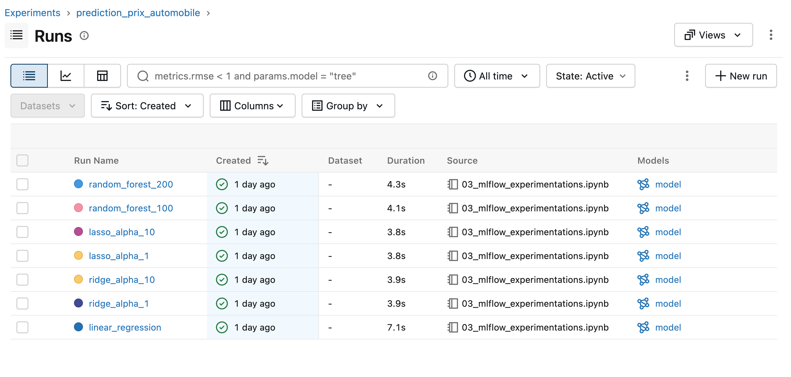
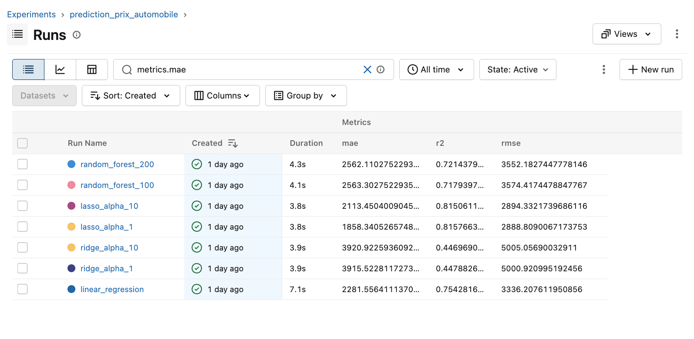
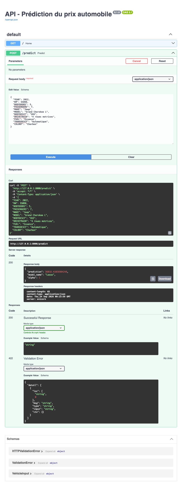
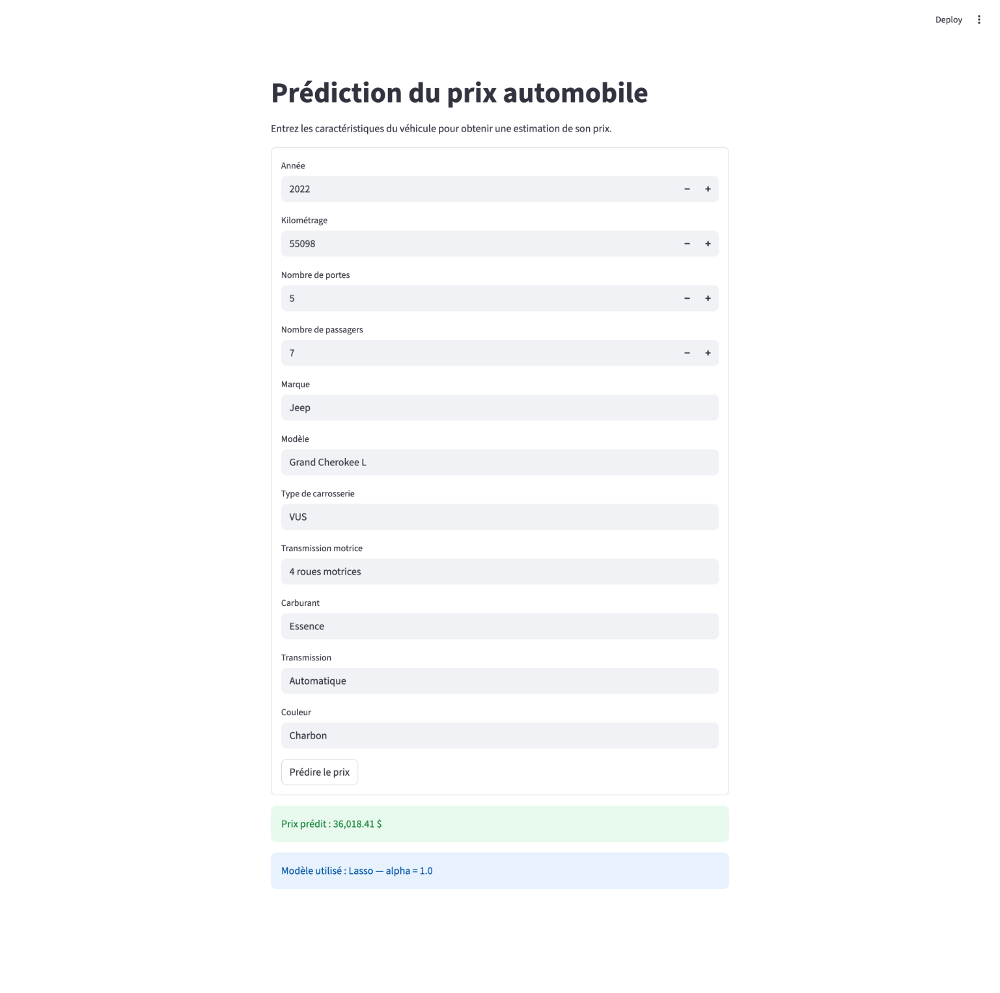

# Rapport final — Prédiction du prix d'un véhicule automobile

## 1. Présentation du problème choisi

Dans le secteur automobile, le prix d'un véhicule peut varier en fonction de plusieurs caractéristiques telles que son année, son kilométrage, sa marque, son modèle, son type de carrosserie ou encore son groupe motopropulseur.

L'objectif de ce projet est de développer un modèle de Machine Learning capable d'estimer le prix d'un véhicule à partir de ces caractéristiques.

Le projet ne se limite pas à l'entraînement d'un modèle. Il met également en place une démarche MLOps simple permettant de suivre plusieurs expérimentations avec MLflow, de comparer leurs performances, de sélectionner un modèle final et de rendre celui-ci utilisable à travers une API FastAPI et une interface Streamlit.

La démarche générale du projet est la suivante :

**Données → Préparation → Entraînement → Expérimentations MLflow → Comparaison → Sélection du modèle → FastAPI → Streamlit**

## 2. Description du dataset

Le dataset utilisé dans ce projet provient d'un concessionnaire automobile. Il contient différentes caractéristiques descriptives de véhicules ainsi que leur prix.

Le dataset initial contient **544 observations**. Après les étapes de nettoyage et de préparation, **543 observations** sont conservées pour la modélisation.

La variable à prédire est :

- `PRICE` : prix du véhicule.

Les variables explicatives retenues sont :

### Variables numériques

- `YEAR` : année du véhicule ;
- `KM` : kilométrage ;
- `BODYDOORS` : nombre de portes ;
- `PASSENGERS` : nombre de passagers.

### Variables catégorielles

- `MAKE` : marque du véhicule ;
- `MODEL` : modèle du véhicule ;
- `BODYDESCF` : type de carrosserie ;
- `DRIVETRAIN` : type de transmission aux roues ;
- `FUEL` : type de carburant ;
- `TRANSDESCF` : type de transmission ;
- `COLORF` : couleur du véhicule.

Après le nettoyage, le dataset utilisé pour la modélisation est sauvegardé dans :

`data/interim/vehicles_clean.csv`

## 3. Type de problème

Le projet correspond à un problème de **régression supervisée**.

Il s'agit d'un apprentissage supervisé puisque le dataset contient, pour chaque véhicule, les caractéristiques utilisées comme variables explicatives ainsi que le prix réel `PRICE` utilisé comme variable cible.

Il s'agit plus précisément d'un problème de régression puisque la valeur à prédire est une valeur numérique continue : le prix d'un véhicule.

L'objectif du modèle est donc d'apprendre la relation entre les caractéristiques des véhicules et leur prix afin de pouvoir estimer le prix d'un nouveau véhicule.

## 4. Préparation des données

La préparation des données a été réalisée principalement dans le notebook :

`notebooks/01_eda_preparation.ipynb`

Le dataset initial contenait **544 observations**. Après le nettoyage, **543 observations** ont été conservées pour la modélisation.

Le dataset nettoyé est sauvegardé dans :

`data/interim/vehicles_clean.csv`

### Séparation des données

Les données sont séparées en deux ensembles :

- **80 %** pour l'entraînement du modèle ;
- **20 %** pour l'évaluation sur le jeu de test.

La séparation est effectuée avec `random_state=42` afin de pouvoir reproduire le même découpage lors des expérimentations.

Cette séparation produit :

- **434 observations** pour l'entraînement ;
- **109 observations** pour le test.

### Transformation des variables

Les variables catégorielles ne peuvent pas être utilisées directement par les modèles testés. Elles sont donc transformées avec :

`OneHotEncoder(handle_unknown="ignore")`

Le One-Hot Encoding transforme les différentes catégories en variables numériques. L'option `handle_unknown="ignore"` permet également d'éviter une erreur lorsqu'une catégorie inconnue est rencontrée lors d'une future prédiction.

Les variables numériques sont conservées telles quelles dans la version actuelle du projet.

### Pipeline de prétraitement

Un `ColumnTransformer` est utilisé pour appliquer les transformations appropriées selon le type de variable :

- One-Hot Encoding pour les variables catégorielles ;
- conservation directe des variables numériques.

Le prétraitement est ensuite combiné avec le modèle de Machine Learning dans un pipeline `scikit-learn`.

Cette approche permet de conserver le prétraitement et le modèle dans un même objet. Le pipeline complet peut ainsi être sauvegardé puis réutilisé par FastAPI pour effectuer une prédiction avec exactement les mêmes transformations que celles utilisées pendant l'entraînement.

## 5. Modèles testés

Plusieurs modèles de régression ont été testés afin de comparer différentes approches de prédiction.

### Linear Regression

La régression linéaire a été utilisée comme premier modèle de référence.

Elle cherche à représenter la relation entre les caractéristiques des véhicules et leur prix à l'aide d'une relation linéaire.

Ce modèle permet d'obtenir une base de comparaison simple avant de tester des modèles avec régularisation ou des modèles plus complexes.

### Ridge

Ridge est une variante de la régression linéaire qui ajoute une régularisation afin de limiter l'importance excessive de certains coefficients.

Deux configurations ont été testées :

- `alpha = 1`
- `alpha = 10`

### Lasso

Lasso est également une régression linéaire régularisée. Contrairement à Ridge, sa régularisation peut réduire certains coefficients jusqu'à zéro.

Deux configurations ont été testées :

- `alpha = 1`
- `alpha = 10`

Pour les expérimentations Lasso, `max_iter=10000` a été utilisé afin de permettre au modèle de disposer d'un nombre suffisant d'itérations pour converger.

### Random Forest Regressor

Random Forest est un modèle basé sur un ensemble d'arbres de décision. Il permet de représenter des relations plus complexes et non linéaires entre les caractéristiques d'un véhicule et son prix.

Deux configurations ont été comparées :

- `n_estimators = 100`
- `n_estimators = 200`

Le paramètre `n_estimators` représente le nombre d'arbres utilisés par la forêt.

### Résumé des configurations

Au total, sept runs valides ont été réalisés :

1. `linear_regression`
2. `ridge_alpha_1`
3. `ridge_alpha_10`
4. `lasso_alpha_1`
5. `lasso_alpha_10`
6. `random_forest_100`
7. `random_forest_200`

## 6. Expérimentations MLflow

MLflow a été utilisé pour assurer le suivi des différentes expérimentations réalisées pendant la phase de modélisation.

Les expérimentations sont réalisées dans le notebook :

`notebooks/03_mlflow_experimentations.ipynb`

L'expérience MLflow créée pour le projet est :

`prediction_prix_automobile`

Chaque configuration de modèle est exécutée dans un run distinct afin de pouvoir comparer les résultats dans l'interface MLflow.

### Informations enregistrées

Pour chaque run, MLflow permet d'enregistrer les principales informations nécessaires à la comparaison des expérimentations.

Les éléments suivis comprennent notamment :

- le nom du modèle ;
- les hyperparamètres utilisés ;
- les métriques obtenues ;
- le modèle entraîné.

Les principaux hyperparamètres suivis dépendent du modèle testé. Par exemple :

- `alpha` pour Ridge et Lasso ;
- `n_estimators` pour Random Forest.

### Métriques utilisées

Trois métriques de régression sont utilisées pour évaluer les modèles :

**MAE — Mean Absolute Error**

La MAE représente l'erreur absolue moyenne entre les prix réels et les prix prédits. Une valeur plus faible indique de meilleures prédictions en moyenne.

**RMSE — Root Mean Squared Error**

Le RMSE mesure également l'erreur de prédiction, mais pénalise davantage les erreurs importantes. Une valeur plus faible est recherchée.

**R² — Coefficient de détermination**

Le R² mesure la proportion de la variation du prix expliquée par le modèle. Une valeur plus élevée indique que le modèle explique une plus grande partie de la variation observée dans les données.

### Suivi des runs

Sept runs valides ont été conservés dans l'expérience :

- `linear_regression`
- `ridge_alpha_1`
- `ridge_alpha_10`
- `lasso_alpha_1`
- `lasso_alpha_10`
- `random_forest_100`
- `random_forest_200`

L'interface MLflow permet ensuite de sélectionner plusieurs runs et de comparer directement leurs paramètres et leurs métriques.

### Capture de l'expérience MLflow



*Figure 1 — Liste des sept runs de l'expérience `prediction_prix_automobile` dans MLflow.*


## 7. Tableau comparatif des runs

Les résultats obtenus pour les sept runs MLflow sont présentés dans le tableau suivant.

| Run MLflow | Modèle | Configuration | MAE | RMSE | R² |
|---|---|---:|---:|---:|---:|
| `linear_regression` | Linear Regression | Baseline | 2281.56 | 3336.21 | 0.7543 |
| `ridge_alpha_1` | Ridge | alpha = 1 | 3915.52 | 5000.92 | 0.4479 |
| `ridge_alpha_10` | Ridge | alpha = 10 | 3920.92 | 5005.06 | 0.4470 |
| `lasso_alpha_1` | Lasso | alpha = 1 | **1858.34** | **2888.81** | **0.8158** |
| `lasso_alpha_10` | Lasso | alpha = 10 | 2113.45 | 2894.33 | 0.8151 |
| `random_forest_100` | Random Forest | n_estimators = 100 | 2563.30 | 3574.42 | 0.7179 |
| `random_forest_200` | Random Forest | n_estimators = 200 | 2562.11 | 3552.18 | 0.7214 |

### Analyse des résultats

Les résultats montrent des différences importantes entre les modèles testés.

La régression linéaire obtient une MAE de **2281.56**, un RMSE de **3336.21** et un R² de **0.7543**. Elle fournit donc une base de comparaison intéressante pour les autres modèles.

Les deux configurations Ridge obtiennent les performances les plus faibles de cette expérimentation, avec un R² d'environ **0.45** et un RMSE supérieur à **5000**.

Les deux modèles Lasso obtiennent les meilleurs R², avec des valeurs supérieures à **0.815**. La configuration `lasso_alpha_1` se distingue également par la MAE et le RMSE les plus faibles de tous les runs.

Les deux configurations Random Forest obtiennent des résultats relativement proches. Le passage de 100 à 200 arbres améliore légèrement le RMSE et le R², mais cette amélioration reste faible.

Globalement, `lasso_alpha_1` présente les meilleures performances parmi les configurations testées sur le jeu de test utilisé dans cette expérimentation.



*Figure 2 — Comparaison des métriques MAE, R² et RMSE des sept runs de l'expérience `prediction_prix_automobile` dans MLflow.*

## 8. Choix du meilleur modèle

À la suite de la comparaison des sept runs, le modèle **Lasso avec `alpha=1`** a été sélectionné comme modèle final.

Sur le jeu de test utilisé, il obtient :

- **MAE : 1858.34**
- **RMSE : 2888.81**
- **R² : 0.8158**

Parmi les configurations testées, `lasso_alpha_1` présente simultanément :

- la MAE la plus faible ;
- le RMSE le plus faible ;
- le R² le plus élevé.

La MAE de **1858.34** signifie que l'écart absolu entre le prix prédit et le prix réel est d'environ **1 858 $ en moyenne** sur le jeu de test.

Le R² de **0.8158** indique que, sur ce jeu de test, le modèle explique environ **81,6 % de la variation observée du prix des véhicules**.

Lasso avec `alpha=10` obtient un R² très proche, mais sa MAE est plus élevée. La configuration `alpha=1` offre donc de meilleurs résultats globaux selon les trois métriques utilisées dans cette expérimentation.

Le pipeline complet de `lasso_alpha_1`, comprenant le prétraitement des données et le modèle, a été sauvegardé dans :

`models/best_model.joblib`

Ce fichier constitue le modèle final utilisé par l'API FastAPI pour effectuer les prédictions.

### Précaution d'interprétation

Le choix du modèle final repose sur les performances obtenues avec une seule séparation train/test utilisant `random_state=42`.

Les résultats montrent donc que Lasso avec `alpha=1` est le meilleur modèle **parmi les configurations testées et pour cette séparation des données**. Ils ne permettent pas d'affirmer qu'il serait systématiquement le meilleur sur toutes les nouvelles données.

## 9. Description de l'API FastAPI

Une API a été développée avec **FastAPI** afin de rendre le modèle de prédiction accessible indépendamment de l'interface utilisateur.

Le code de l'API se trouve dans :

`api/main.py`

### Chargement du modèle

Au démarrage de l'API, le pipeline sélectionné lors des expérimentations est chargé depuis :

`models/best_model.joblib`

Ce fichier contient à la fois :

- le prétraitement des variables ;
- le modèle Lasso sélectionné.

L'API utilise donc directement le pipeline final sauvegardé à la suite des expérimentations.

### Route de prédiction

La principale route de l'API est :

`POST /predict`

Cette route reçoit les caractéristiques d'un véhicule sous forme de données JSON.

Par exemple :

```json
{
  "YEAR": 2022,
  "KM": 55098,
  "BODYDOORS": 5,
  "PASSENGERS": 7,
  "MAKE": "Jeep",
  "MODEL": "Grand Cherokee L",
  "BODYDESCF": "VUS",
  "DRIVETRAIN": "4 roues motrices",
  "FUEL": "Essence",
  "TRANSDESCF": "Automatique",
  "COLORF": "Charbon"
}
```



*Figure 3 — Test de la route `POST /predict` dans Swagger. L'API retourne une réponse HTTP 200 contenant le prix prédit ainsi que les informations sur le modèle Lasso utilisé.*


## 10. Description de l'interface Streamlit

Une interface utilisateur a été développée avec **Streamlit** afin de permettre d'utiliser le modèle de prédiction sans avoir à envoyer manuellement une requête à l'API.

Le code de l'interface se trouve dans :

`app/streamlit_app.py`

### Saisie des caractéristiques

L'interface permet à l'utilisateur de saisir les différentes caractéristiques nécessaires à la prédiction du prix d'un véhicule, notamment :

- l'année ;
- le kilométrage ;
- le nombre de portes ;
- le nombre de passagers ;
- la marque ;
- le modèle ;
- le type de carrosserie ;
- le groupe motopropulseur ;
- le carburant ;
- la transmission ;
- la couleur.

Une fois les informations saisies, l'utilisateur peut demander une estimation du prix.

### Communication avec FastAPI

Streamlit n'effectue pas directement la prédiction.

Lorsqu'une prédiction est demandée, l'application construit les données du véhicule puis les transmet à la route `POST /predict` de FastAPI à l'aide d'une requête HTTP.

L'architecture utilisée est donc :

**Utilisateur → Streamlit → requête HTTP → FastAPI → pipeline ML → prédiction → FastAPI → Streamlit**

Cette séparation permet de centraliser la logique de prédiction dans FastAPI. Streamlit joue uniquement le rôle d'interface utilisateur.

### Affichage du résultat

Après réception de la réponse de FastAPI, l'interface affiche :

- le prix prédit du véhicule ;
- le nom du modèle utilisé ;
- la valeur du paramètre `alpha`.

Pour le véhicule utilisé lors du test de l'application, l'interface affiche un prix prédit d'environ :

**36 018,41 $**

Le modèle indiqué par l'API est :

**Lasso — alpha = 1**



*Figure 4 — Prédiction du prix d'un véhicule depuis l'interface Streamlit. Le prix prédit est de 36 018,41 $ avec le modèle Lasso utilisant alpha = 1.*

## 11. Limites du projet

Même si le projet permet d'obtenir un modèle fonctionnel et de réaliser une chaîne complète allant des données jusqu'à l'interface utilisateur, certaines limites doivent être prises en compte.

### Taille du dataset

Le dataset utilisé pour la modélisation contient seulement **543 observations** après nettoyage.

Cette quantité de données est suffisante pour réaliser le projet et comparer différentes approches, mais elle reste relativement faible pour représenter toute la diversité du marché automobile.

Les performances obtenues doivent donc être interprétées dans le contexte de ce dataset.

### Évaluation sur une seule séparation train/test

Les différents modèles ont été comparés à partir d'une seule séparation des données avec :

`random_state=42`

Les résultats peuvent varier si les observations utilisées pour l'entraînement et le test sont réparties différemment.

Le modèle sélectionné est donc celui qui obtient les meilleures performances pour la séparation utilisée dans cette expérimentation.

### Absence de standardisation des variables numériques

Les variables numériques ont été utilisées sans standardisation.

Cette décision peut avoir un impact sur certains modèles linéaires régularisés comme Ridge et Lasso, puisque les variables peuvent avoir des échelles très différentes. Par exemple, le kilométrage peut atteindre plusieurs milliers de kilomètres alors que le nombre de portes reste une petite valeur.

L'effet d'une standardisation des variables numériques n'a pas été évalué dans la version actuelle du projet.

### Nombre limité de modèles et d'hyperparamètres

Le projet compare plusieurs modèles et sept runs MLflow, mais l'espace des configurations testées reste volontairement limité.

Par exemple, seules deux valeurs de `alpha` ont été testées pour Ridge et Lasso et deux nombres d'arbres ont été testés pour Random Forest.

Il est donc possible que d'autres configurations obtiennent de meilleures performances.

### Environnement local

FastAPI, Streamlit et MLflow sont actuellement exécutés localement.

Le projet démontre le fonctionnement complet de l'architecture, mais il ne comprend pas encore les éléments nécessaires à un déploiement en production tels que l'hébergement, la gestion de la sécurité, la supervision ou la mise à l'échelle de l'application.

## 12. Améliorations possibles

Plusieurs améliorations pourraient être apportées afin de rendre l'évaluation des modèles plus robuste et de faire évoluer l'application.

### Utiliser davantage de données

L'ajout de véhicules supplémentaires permettrait d'obtenir un dataset plus représentatif de la diversité du marché automobile.

Un volume de données plus important permettrait également de mieux représenter les différentes marques, modèles, années et configurations de véhicules.

### Ajouter une validation croisée

Dans la version actuelle, les modèles sont évalués à partir d'une seule séparation train/test.

L'utilisation de la validation croisée permettrait d'évaluer chaque modèle sur plusieurs partitions des données et d'obtenir une estimation plus robuste de ses performances.

### Évaluer la standardisation des variables numériques

Une amélioration importante serait de tester la standardisation des variables numériques, notamment pour Ridge et Lasso.

Un `StandardScaler` pourrait être intégré au pipeline pour les variables numériques, puis de nouvelles expérimentations MLflow permettraient de comparer les résultats avec ceux obtenus actuellement.

### Tester davantage d'hyperparamètres

Les expérimentations pourraient être étendues avec davantage de valeurs pour les hyperparamètres.

Par exemple :

- tester plusieurs valeurs de `alpha` pour Ridge et Lasso ;
- tester différents nombres d'arbres pour Random Forest ;
- explorer d'autres paramètres de Random Forest.

Ces nouvelles configurations pourraient être suivies dans MLflow afin de conserver une comparaison structurée des résultats.

### Ajouter des tests automatisés

Des tests automatisés pourraient être ajoutés afin de vérifier notamment :

- le chargement du modèle ;
- le format des données envoyées à l'API ;
- le fonctionnement de la route `/predict` ;
- le format de la réponse retournée par FastAPI.

### Conteneuriser et déployer l'application

Une évolution possible serait de conteneuriser les différents composants avec Docker afin de faciliter la reproduction et le déploiement de l'environnement.

FastAPI et Streamlit pourraient ensuite être déployés sur un serveur afin de rendre l'application accessible à distance.

Ces améliorations permettraient de faire évoluer le projet actuel vers une architecture plus robuste tout en conservant la même démarche générale.

## 13. Conclusion

Ce projet avait pour objectif de développer un modèle de Machine Learning capable d'estimer le prix d'un véhicule automobile à partir de ses caractéristiques et de l'intégrer dans une démarche MLOps simple.

Après la préparation des données, plusieurs modèles et configurations ont été entraînés et suivis avec MLflow. Au total, sept runs ont été comparés à l'aide des métriques MAE, RMSE et R².

Parmi les configurations testées, **Lasso avec `alpha=1`** a obtenu les meilleures performances sur le jeu de test utilisé, avec une MAE de **1858.34**, un RMSE de **2888.81** et un R² de **0.8158**.

Le pipeline contenant le prétraitement et le modèle sélectionné a ensuite été sauvegardé dans `models/best_model.joblib`.

Une API FastAPI a été mise en place afin d'exposer le modèle à travers la route `POST /predict`. Une interface Streamlit communique avec cette API par requête HTTP et permet à un utilisateur de saisir les caractéristiques d'un véhicule puis d'obtenir une estimation de son prix.

Le projet permet ainsi de mettre en pratique les différentes étapes d'un processus de Machine Learning : préparation des données, expérimentation, suivi avec MLflow, comparaison des résultats, sélection et sauvegarde d'un modèle, puis utilisation de celui-ci dans une application.

Les résultats obtenus restent liés au dataset et à la méthode d'évaluation utilisés. Des améliorations telles que la validation croisée, la standardisation des variables numériques et l'utilisation de davantage de données permettraient de poursuivre et de renforcer le projet.